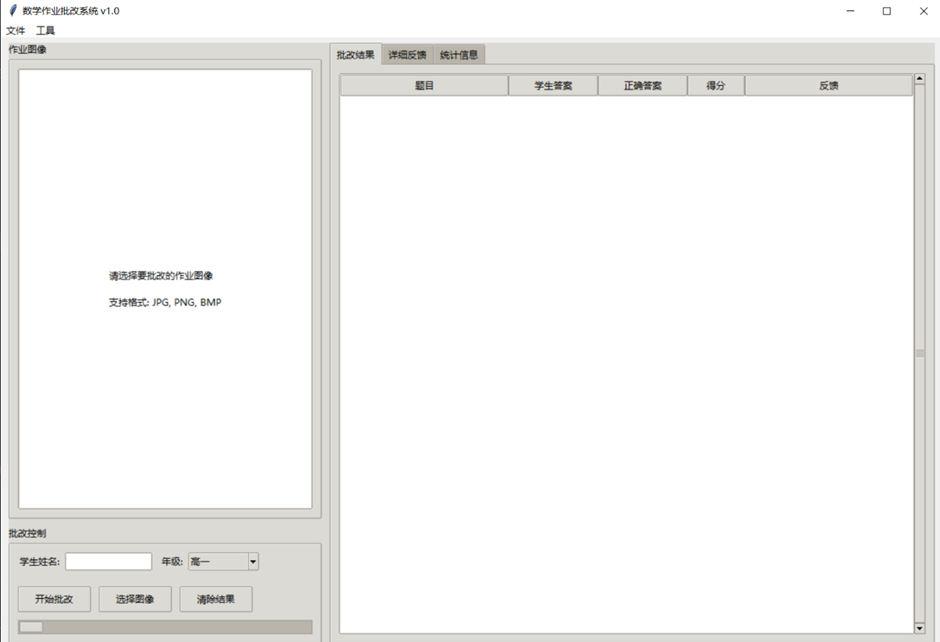

# 万物皆数｜智能数学作业批改系统

**AI辅助 × 作业分析 × 学情洞察的智慧教学新篇章**

## 目录

- [一、项目名称与定位](#一项目名称与定位)
  - [项目名称：万物皆数｜智能数学作业批改系统](#项目名称万物皆数智能数学作业批改系统)
  - [核心定位](#核心定位)
  - [核心痛点与问题解决](#核心痛点与问题解决)
- [二、开发初衷与价值](#二开发初衷与价值)
- [三、AI核心功能模块](#三ai核心功能模块)
- [四、AI 技术架构与应用亮点](#四ai-技术架构与应用亮点)
  - [NVIDIA AI Foundation Models集成](#nvidia-ai-foundation-models集成)
  - [智能模型选择器](#智能模型选择器)
  - [MCP服务与客户端构建实现](#mcp服务与客户端构建实现)
  - [通信协议设计](#通信协议设计)
- [五、Agentic AI平台框架与工具构建](#五agentic-ai平台框架与工具构建)
  - [AI智能体架构：](#ai智能体架构)
  - [智慧体核心能力：](#智慧体核心能力)
- [六、技术创新点](#六技术创新点)
  - [智能年级适配算法](#智能年级适配算法)
  - [实时图像处理优化](#实时图像处理优化)
  - [异步任务管理创新](#异步任务管理创新)
  - [领先技术应用](#领先技术应用)
- [七、UI页面优化设计](#七ui页面优化设计)
  - [用户接口设计理念](#用户接口设计理念)
  - [交互体验优化](#交互体验优化)
  - [数据可视化增强](#数据可视化增强)
  - [统计图表](#统计图表)
  - [用户体验细节](#用户体验细节)
  - [跨平台适配](#跨平台适配)
- [八、项目放置处](#八项目放置处)
- [九、团队介绍](#九团队介绍)
- [十、总结](#十总结)
  - [我们的收获：从想象到实践，从数据到共情](#我们的收获从想象到实践从数据到共情)
  - [我们的希望：让AI不只是「分析工具」，更是教学路上的那位「得力好伙伴」](#我们的希望让ai不只是分析工具更是教学路上的那位得力好伙伴)
- [十一、未来展望：拓展「AI助教」边界，共绘「数智教育」可持续蓝图](#十一未来展望拓展ai助教边界共绘数智教育可持续蓝图)

## 一、项目名称与定位

### 项目名称：万物皆数｜智能数学作业批改系统

- 「万物皆数｜智能数学作业批改系统」是一款融合AI自动批改、学习数据分析与教学策略辅助的智能教学系统。专注于数学学科领域，提供基于学生作业表现的实时学情洞察与数据化教学备课建议。

- 项目名称以此为主题，主要是透过一句话马上就能点出我们制作的初衷精神：「万物皆有数，教学亦有道。让AI不仅懂数据，更懂教育，辅助老师洞察每位学生的学习轨迹与潜能。」

### 核心定位

- 一位具备深度学习与教育数据分析能力的AI智慧助教，融合自动化作业批改、多维度学情洞察与个性化教学辅助，专为数学教师打造「高效批改 × 精准分析 × 启发教学」的全新辅助体验。

- 从每份作业的细微之处到班级整体的知识掌握，**「AI助教」都能分析得明明白白**

### 核心痛点与问题解决

- 传统批改效率低：教师手工批改作业耗时长，无法及时回馈
- 回馈缺乏针对性：传统批改缺少个性化的学习建议
- 学习数据缺失：无法有效跟踪学生学习进度和薄弱环节
- 教学资源不足：缺乏针对性的练习题生成机制

## 二、开发初衷与价值

- 协助教师从繁杂的学生作业与数据中，快速洞察「个别学生当下最关键的学习症结与需求」。

- 实践「万物皆数」核心理念，引导教师依据数据化的学情分析，进行「因材施教」的精准教学。

- 透过AI智慧分析，提供「富含洞察、支持教学决策」的辅助，让科技赋能有温度的教育。

- 提升教师教学效率与学生学习成效，并建立以「数据智能」为核心的差异化辅助教学价值。

## 三、AI核心功能模块

| 模块名称 | 功能说明 |
|---------|---------|
| 作业数据化处理模块 | 接收并处理多种格式的学生作业提交（如扫描件、照片、电子文文件）。对图像化作业进行光学字符识别（OCR），提取并结构化学生答案、解题步骤等关键数据，供后续AI分析使用。 |
| AI自动批改引擎 | 运用机器学习模型、自然语言处理及默认数学规则，自动批改学生提交的数学作业。不仅判断答案对错，亦能根据解题过程识别初步的错误类型，大幅提升批改效率。 |
| 学生作答深度解析模块 | 超越传统对错判断，深入分析学生的解题方法、错误模式及常见迷思概念。区分学生的错误属于概念理解型、计算失误型还是解题策略型，为精准学情诊断提供细致依据。 |
| 学情智能分析与洞察引擎 | 汇总个体学生的作答数据与批改结果，应用数据挖掘与统计分析技术，生成班级整体及个体学生的学习画像。直观展示学生在特定知识点、技能目标上的掌握程度、强弱项分布及潜在学习断点。 |
| 个性化教学辅助模块 | 根据学情洞察引擎的分析结果，为教师生成可操作的教学优化建议。包括但不限于：调整教学进度与内容、针对性强化特定知识点、提供差异化教学策略、推荐辅助练习资源等，实现「因材施教」。 |
| 数学知识库与教学策略模块 | 内建结构化的数学学科知识图谱（涵盖概念定义、公式定理、解题方法等）、课程标准、常见学生错误类型库以及经实证有效的教学策略。此模块为AI的分析判断与建议生成提供专业知识支持，确保辅助的科学性与准确性。（可结合RAG架构提升知识应用能力） |
| 教师互动与报告系统（AI助教） | 提供直观易用的用户接口，方便教师上传作业、查阅批改结果、浏览交互式的学情分析仪表板（包含图表、数据报告等），并获取「AI助教」提供的个性化教学建议。 |

## 四、AI 技术架构与应用亮点

### NVIDIA AI Foundation Models集成

我们的系统集成了NVIDIA领先的AI Foundation Models，通过NVIDIA API接口实现强大的多模态AI能力。系统采用智能模型选择策略，针对不同的教学场景和任务复杂度，自动选择最优的模型组合。

#### 核心模型架构

| 模型名称 | 模型类型 | 应用场景 | 技术特点 |
|---------|---------|---------|---------|
| **nvidia/llama-3.2-90b-vision-instruct** | 视觉理解模型 | 作业图像分析、手写识别 | • 90B参数规模，强大的视觉理解能力<br>• 支持数学公式、图形、表格识别<br>• 多模态融合处理能力<br>• 最大token限制：4000 |
| **nvidia/llama-3.1-8b-instruct** | 文本生成模型 | 反馈生成、教学建议 | • 高效的文本理解与生成<br>• 优化的推理速度<br>• 适合中等复杂度任务<br>• 最大token限制：2000 |
| **nvidia/llama-3.1-70b-instruct** | 数学专用模型 | 复杂数学分析、深度推理 | • 70B参数，专业数学推理能力<br>• 高级数学概念理解<br>• 复杂问题解决方案生成<br>• 最大token限制：4000 |

#### NVIDIA API技术优势

```python
# NVIDIA API集成示例
import nvidia_api

class NVIDIAModelIntegration:
    def __init__(self):
        self.api_client = nvidia_api.Client(
            api_key="your_nvidia_api_key",
            base_url="https://integrate.api.nvidia.com/v1"
        )
        
    async def process_with_vision_model(self, image_data, prompt):
        """使用视觉模型处理图像和文本"""
        response = await self.api_client.chat.completions.create(
            model="nvidia/llama-3.2-90b-vision-instruct",
            messages=[
                {
                    "role": "user", 
                    "content": [
                        {"type": "text", "text": prompt},
                        {"type": "image_url", "image_url": {"url": image_data}}
                    ]
                }
            ],
            max_tokens=4000,
            temperature=0.1
        )
        return response.choices[0].message.content
```

#### 技术优势与特点

| 优势特点 | 详细说明 |
|---------|---------|
| **企业级稳定性** | • NVIDIA云基础设施保障<br>• 99.9%+的服务可用性<br>• 全球分布式部署 |
| **性能优化** | • GPU加速推理<br>• 毫秒级响应时间<br>• 高并发处理能力 |
| **安全保障** | • 企业级数据加密<br>• 符合教育行业隐私标准<br>• API密钥管理 |
| **成本效益** | • 按需付费模式<br>• 智能资源调度<br>• 成本优化算法 |

### 智能模型选择器

我们开发了智能模型选择器，能够根据任务特点自动选择最适合的NVIDIA模型，实现资源的最优配置。

```python
class ModelSelector:
    """智能模型选择器"""
    
    def __init__(self):
        self.available_models = {
            "nvidia/llama-3.2-90b-vision-instruct": ModelInfo(
                "nvidia/llama-3.2-90b-vision-instruct",
                ModelType.VISION, 
                max_tokens=4000,
                cost_per_token=0.002  # 示例定价
            ),
            "nvidia/llama-3.1-8b-instruct": ModelInfo(
                "nvidia/llama-3.1-8b-instruct",
                ModelType.TEXT,
                max_tokens=2000,
                cost_per_token=0.0005
            ),
            "nvidia/llama-3.1-70b-instruct": ModelInfo(
                "nvidia/llama-3.1-70b-instruct",
                ModelType.MATH,
                max_tokens=4000,
                cost_per_token=0.001
            )
        }
    
    def select_model(self, task_type: str, image_included: bool = False, 
                    complexity: str = "medium") -> str:
        """智能选择最适合的NVIDIA模型"""
        
        if image_included and task_type == "grading":
            # 包含图像的作业批改 -> 视觉模型
            return "nvidia/llama-3.2-90b-vision-instruct"
            
        elif task_type == "feedback":
            # 反馈生成任务 -> 根据复杂度选择
            if complexity == "high":
                return "nvidia/llama-3.1-70b-instruct"
            else:
                return "nvidia/llama-3.1-8b-instruct"
                
        elif task_type == "analysis":
            # 深度数学分析 -> 数学专用模型
            return "nvidia/llama-3.1-70b-instruct"
            
        # 默认选择平衡性能的模型
        return "nvidia/llama-3.1-8b-instruct"
```

#### 模型选择策略

| 任务场景 | 推荐模型 | 选择理由 |
|---------|---------|---------|
| 手写作业识别 | llama-3.2-90b-vision | 强大的视觉理解能力，精确识别手写数学符号 |
| 简单反馈生成 | llama-3.1-8b-instruct | 高效快速，适合批量处理 |
| 复杂数学推理 | llama-3.1-70b-instruct | 专业数学能力，深度逻辑分析 |
| 多模态分析 | llama-3.2-90b-vision | 图文并茂的综合理解 |

### MCP服务与客户端构建实现

#### 服务端实现 (server.py)

**协议层设计**

- 采用WebSocket确保实时通信
- JSON-RPC 2.0标准化API调用
- 自定义消息类型扩展

**智能批改引擎**

```python
# 智能批改引擎核心代码示例
def grade_assignment(self, assignment_data, grade_level):
    # 分级处理算法
    if grade_level == "高一":
        return self.analyze_senior_1(assignment_data)  # 集合、函数、不等式专项分析
    elif grade_level == "初二":
        return self.analyze_junior_2(assignment_data)  # 因式分解、分式、二次根式
    elif grade_level == "高三":
        return self.analyze_senior_3(assignment_data)  # 导数、积分、概率统计
```

#### 客户端实现 (client.py)

```python
class MCPClient:
    def __init__(self, server_url):
        self.server_url = server_url
        self.connection_pool = ConnectionPool()
        
    async def submit_assignment(self, data):
        # 连接池管理：自动重连和连接状态监控
        # 异步处理：非阻塞式客户端调用
        # 错误处理：完善的异常捕获和重试机制
        pass
```

**技术亮点：**

- 连接池管理：自动重连和连接状态监控
- 异步处理：非阻塞式客户端调用
- 错误处理：完善的异常捕获和重试机制

### 通信协议设计

**请求格式**

```json
{
    "jsonrpc": "2.0",
    "method": "grade_assignment",
    "params": {
        "assignment_data": "...",
        "grade_level": "高一",
        "subject": "数学",
        "model_preference": "nvidia/llama-3.2-90b-vision-instruct"
    },
    "id": 1
}
```

**回应格式**

```json
{
    "jsonrpc": "2.0",
    "result": {
        "score": 85,
        "analysis": "...",
        "suggestions": "...",
        "model_used": "nvidia/llama-3.1-70b-instruct",
        "processing_time": 1.2
    },
    "id": 1
}
```

## 五、Agentic AI平台框架与工具构建

### AI智能体架构：

**NVIDIA AI集成：**

```python
from nvidia_ai import NVIDIAModel

class IntelligentGradingAgent:
    def __init__(self):
        # 多模型协同工作
        self.vision_model = NVIDIAModel('nvidia/llama-3.2-90b-vision-instruct')
        self.text_model = NVIDIAModel('nvidia/llama-3.1-8b-instruct')
        self.math_model = NVIDIAModel('nvidia/llama-3.1-70b-instruct')
        self.model_selector = ModelSelector()
        self.initialize_agent()
    
    async def process_assignment(self, assignment_data, context):
        """多模型协同处理作业"""
        # 步骤1：智能选择模型
        selected_model = self.model_selector.select_model(
            task_type=context.get('task_type'),
            image_included=context.get('has_image'),
            complexity=context.get('complexity')
        )
        
        # 步骤2：执行AI分析
        if selected_model == "nvidia/llama-3.2-90b-vision-instruct":
            result = await self.vision_model.analyze(assignment_data)
        elif selected_model == "nvidia/llama-3.1-70b-instruct":
            result = await self.math_model.analyze(assignment_data)
        else:
            result = await self.text_model.analyze(assignment_data)
            
        # 步骤3：结果后处理
        return self.post_process_result(result, context)
```

**AI Agent设计模式：**

```python
class MathGradingAgent:
    def __init__(self):
        self.perception_module = PerceptionModule()
        self.reasoning_module = ReasoningModule()
        self.action_module = ActionModule()
        
    def process_assignment(self, assignment):
        # 感知 -> 推理 -> 行动
        perceived_data = self.perception_module.analyze(assignment)
        reasoning_result = self.reasoning_module.process(perceived_data)
        return self.action_module.generate_feedback(reasoning_result)
```

**多模态AI工作流**

1. **图像输入处理**
   - OCR文字识别（基于NVIDIA视觉模型）
   - 数学公式解析（专业符号识别）
   - 图形几何识别（图表、图形理解）

2. **智能分析引擎**
   - 答案正确性判断（NVIDIA数学模型）
   - 解题过程分析（逻辑推理验证）
   - 错误类型分类（智能诊断）

3. **反馈生成系统**
   - 个性化建议生成（NVIDIA文本模型）
   - 知识点关联分析（知识图谱）
   - 学习路径规划（个性化推荐）

### 智慧体核心能力：

| 核心能力 | 说明 | NVIDIA模型应用 |
|---------|------|-------------|
| 自我调整学习 | 学生画像构建：基于历史资料分析学习特点<br>难度动态调整：根据学生水平调整评判标准<br>知识图谱映像：构建个人知识掌握图谱 | llama-3.1-70b-instruct<br>专业数学推理和学习模式分析 |
| 多模态融合 | 视觉理解：图像中的数学符号和图形识别<br>语言理解：数学文字题的语义解析<br>逻辑推理：数学解题过程的逻辑验证 | llama-3.2-90b-vision-instruct<br>图文多模态理解 |
| 迭代优化 | 回馈学习：从教师纠正中学习改进<br>模型微调：基于特定年级和知识点优化 | 全模型协同<br>持续学习和优化 |

## 六、技术创新点

### 智能年级适配算法

```python
def adaptive_grading_algorithm(student_data, grade_level):
    # 各年级独立的评判标准
    grading_standards = load_grade_standards(grade_level)
    
    # 知识点难度智能匹配
    difficulty_match = match_difficulty(student_data, grade_level)
    
    # 个性化回馈范本
    feedback_template = generate_personalized_feedback(student_data)
    
    return process_with_standards(grading_standards, difficulty_match, feedback_template)
```

**技术亮点：**

- 各年级独立的评判标准
- 知识点难度智能匹配
- 个性化回馈范本

### 实时图像处理优化

```python
import cv2
import numpy as np

class ImageProcessor:
    def __init__(self):
        self.ocr_engine = initialize_ocr()
        
    def preprocess_image(self, image):
        # 图像预处理优化
        gray = cv2.cvtColor(image, cv2.COLOR_BGR2GRAY)
        denoised = cv2.fastNlMeansDenoising(gray)
        return cv2.threshold(denoised, 0, 255, cv2.THRESH_BINARY + cv2.THRESH_OTSU)
```

### 异步任务管理创新

```python
import asyncio
from concurrent.futures import ThreadPoolExecutor

class AsyncTaskManager:
    def __init__(self):
        self.executor = ThreadPoolExecutor(max_workers=4)
        
    async def process_multiple_assignments(self, assignments):
        tasks = [self.process_single_assignment(assignment) for assignment in assignments]
        results = await asyncio.gather(*tasks)
        return results
```

### 领先技术应用

| 项目 | 说明 |
|------|------|
| MCP协议深度定制 | - 扩展JSON-RPC 2.0支持自定义消息类型<br>- WebSocket长连接优化，支持大文件传输<br>- 协议版本向后兼容机制 |
| AI Prompt Engineering优化 | - 针对数学领域的专业提示词设计<br>- 分级评判标准的Prompt模板化<br>- 结构化输出格式强制约束<br>- NVIDIA模型特定优化 |
| 混合架构设计 | - 本地GUI + 远程AI服务的混合模式<br>- 脱机/在线无缝切换机制<br>- 多AI模型负载均衡<br>- NVIDIA API智能调度 |

## 七、UI页面优化设计

### 用户接口设计理念



**设计亮点：**

| 亮点 | 说明 |
|------|------|
| 黄金分割布局 | 左侧图像区占38%，右侧结果区占62% |
| 一键操作 | 拖拽上传、一键批改、快速汇出 |
| 渐进式展示 | 结果分tab展示，信息层次清晰 |

### 交互体验优化

**文件上传优化：**

```python
class FileUploadHandler:
    def __init__(self):
        self.supported_formats = ['.jpg', '.png', '.pdf', '.docx']
        
    def handle_drag_drop(self, files):
        # 拖拽上传处理
        for file in files:
            if self.validate_format(file):
                self.process_upload(file)
```

**响应式回馈：**

- 实时进度条显示批改进度
- 状态栏显示操作时间戳
- 错误提示渐变动画

### 数据可视化增强

**结果展示优化：**

```python
import matplotlib.pyplot as plt
import seaborn as sns

class DataVisualization:
    def create_performance_chart(self, student_data):
        # 创建学生表现图表
        fig, ax = plt.subplots(figsize=(10, 6))
        sns.barplot(data=student_data, x='subject', y='score', ax=ax)
        return fig
```

### 统计图表

- 正确率饼图
- 知识点雷达图
- 历史成绩曲线
- 错误类型分布

### 用户体验细节

**智能提示系统：**

```python
class SmartTipsSystem:
    def __init__(self):
        self.tips_database = load_tips()
        
    def get_contextual_tip(self, user_action):
        # 根据用户操作提供智能提示
        return self.tips_database.get(user_action, "默认提示")
```

**快捷键支持：**

- Ctrl+O：快速打开图像
- Ctrl+E：汇出结果
- Ctrl+Q：退出应用

**容错提示：**

- 网络断开时的友好提示
- AI服务不可用时的降级说明
- 文件格式错误的详细指导

### 跨平台适配

**响应式布局**

- 支持1200x800到1920x1080分辨率
- 组件自适应缩放
- 字体大小智能调整

**主题定制**

- 支持浅色/深色主题切换
- 高对比度模式适配
- 色彩无障碍设计

## 八、项目放置处

- **GitHub仓库**: https://github.com/runningwithtime/Intelligent-mathematics-homework-correction-system

- **专案介绍视频**: https://www.bilibili.com/video/BV1wDj8zUEo1/?share_source=copy_web&vd_source=afc65fcdd6658f515e114191d871bda0

## 九、团队介绍

**团队中心信念：**我们相信，技术不应仅是呈现「万物有数」的冰冷逻辑，更应是能洞察教学需求、与师者匠心共振的温暖助力。

**团队特质：**

- 技术有深度，辅助有温度，洞察有精度。
- 我们不只建构AI，我们致力打造能与教师「共情」、助力「因材施教」的智慧教学伙伴。

**成员介绍：**

### 【李怡芬】｜总体系统架构师 × 项目航程的掌舵手

**定位：**「AI助手」技术蓝图的总规划／跨团队协作的关键链结／项目从0到1的实现总指挥

- 能以全局视野清晰擘划「AI助教」的系统架构，确保其稳定运行与未来的良好扩展性
- 精通跨模块整合与资源调度，是「万物有数」团队高效协作，确保项目按时推进的核心
- 在项目开发的各个阶段进行严谨把关，为「AI助教」系统的整体质量与用户价值保驾护航
- 带领团队进行脑力激荡，打开视野、对齐愿景

### 【徐向】｜MCP核心技术匠人 × 系统效能守护神

**定位：**「AI助教」运算引擎的总设计／AI模型稳定运行的基石／复杂数据处理的加速引擎

- 对技术细节有着极致的追求与打磨，相信优雅的架构能创造非凡的系统效能
- 主导建构了「AI助教」的MCP（核心运算平台），确保AI分析的快速响应与高并发处理
- 他的工作确保了「AI助教」在面对海量数据时依然稳健如初。

### 【李浩然】｜数据策略擘划者 × 学情洞察建筑师

**定位：**「AI助教」数据蓝图的规划师／「万物有数」理念的数据转译者／学情分析精准性的守护者

- 总能从复杂的学生数据中理出头绪，让「数」说出教学上真正有意义的故事
- 专注于构建清晰、高效的数据管道与模型，为「AI助教」的智能分析奠定坚实基础
- 他坚持数据的严谨性，是「AI助教」能够精准洞察学情、辅助教学的关键核心

### 【柳福祥】｜设计方向导航员 × 体验的灵魂塑造师

**定位：**产品理念的诠释者／教师视角的代言人／团队设计思考的催化剂

- 总能一针见血地提出「如何让『AI助教』更懂老师心」的关键叩问，引领设计方向
- 擅长将「万物有数」的抽象理念与教学的实际需求，巧妙转化为具体、友善的用户体验
- 持续关注教育科技趋势与使用者回馈，确保「AI助教」的设计既有前瞻性，又不失落地实用

因为有大家，「AI助教」才会是一位不仅懂「数」、更有灵魂的AI。技术再强大，若缺少对「师者匠心」的体察与对「学子困惑」的理解，便不能成为真正有价值的教育AI，而我们做到了！【万物有数】，它不仅是一个高效的分析工具，更是一个能与教育者同心共行、点亮教学智慧的同盟。

## 十、总结

**团队总结回顾｜让「数」有智能，让教育有温度**

### 我们的收获：从想象到实践，从数据到共情

这段旅程，对我们「万物有数」团队而言，不只是一项AI系统的开发任务，更是一场对教育本质的深度探索：「科技真能洞悉学生的学习奥秘吗？冰冷的数据能否转化为有温度的教学辅助？AI可以成为老师教学路上一位值得信赖的伙伴吗？」

我们从最初一个坚定的信念「让数据洞察赋能每一位教师，让『万物有数』的理念在教育中发光」，开始踏上这条融合AI算法、教育数据分析与真实教学场景理解的创新之路。过程中，我们不断在算法的精确性与教学的灵活性、数据的客观性与教育的人文关怀、技术的前瞻性与应用的实效性之间进行探索、拉扯与平衡。

我们建立了一个能基于「学生作答数据 × 知识点关联 × 错误类型分析」提供深度教学洞察的AI助教。它不仅是一个高效的分析引擎，更像一位细心的观察者，能在老师面对班级整体学情时，清晰呈现各知识点的掌握情况；在老师困惑于个别学生学习难点时，尝试精准指出可能的症结，彷佛在说：「老师，您的辛劳与挑战，『我懂』懂，并希望能为您分忧解难。」

我们收获的不仅是一套辅助教学系统，更是一次深刻的体悟，关于如何让AI真正贴近教学的真实需求，理解「师者匠心」的深意，并实践「让教育有温度」的理想。也许目前的功能尚在持续完善，但它已经开始懂得如何更好地「助你教」。

### 我们的希望：让AI不只是「分析工具」，更是教学路上的那位「得力好伙伴」

我们希望，有一天老师们开启「AI助教」，不只是为了批改作业或检视报表，而是在教学感到困惑、寻求突破时，能对「AI助教」说：「这个班级的学习成效，我总觉得还能再提升，但该从何着手呢？」然后「AI助教」能真正理解老师的用心与处境，在老师需要教学方向时，清晰地呈现数据背后的洞察，并温和地建议：「老师，根据学生的整体学习轨迹与细节表现，或许我们可以一同从这几个方向尝试探索。」

我们希望「AI助教」是老师教学日常中那位默契十足又恰到好处的伙伴：

- 不打扰正常的教学节奏，却总在老师需要数据左证或教学灵感时，默默提供精准的支持。
- 不做空泛的建议与指令，但每一项数据分析都力求深刻，每一份教学提示都切中育人的要点。
- 不取代师者的专业智慧与情感投入，只是忠实呈现「万物有数」的客观洞察，衷心期盼能为老师的「传道授业解惑」之路锦上添花，让教育的果实更丰硕一点，再丰硕一点。

这不只是我们对这款AI助教的期待，更是我们「万物有数」团队对「科技如何在教育领域展现应有温度、深度与价值」的深刻想象与不懈追求。

## 十一、未来展望：拓展「AI助教」边界，共绘「数智教育」可持续蓝图

透过「智能数学作业批改系统」的实作完成，验证了我们「万物有数」团队运用数据智能赋能教育的初步构想，也让我们更深刻地体会到科技在辅助教学、关怀师生方面所能扮演的积极角色。然而，这仅是探索「数智教育」无限潜能的序章。我们深知，要让「AI助教」真正成为每位教师不可或缺的温暖伙伴与得力助手，持续的设想、清晰的规划与踏实的进化至关重要。我们对「AI助教」的未来发展，抱持着务实的蓝图与不渝的热忱：

### 一、功能深化与智能化升级：追求更极致的精准洞察与前瞻辅助

**设想与规划：**

1. **精微化学情诊断：**
   「AI助教」将超越现有的错误类型分析，深度学习学生在解题思路、认知模式及前置知识掌握上的细微差异，建立更精准的学生个人学习画像。

2. **预测性分析与主动预警：**
   研发并引入预测模型，使「AI助教」不仅能分析「已然」，更能预见「未然」。如提前识别潜在学习困难学生、预测知识点掌握的瓶颈期，或主动提示教学进度与课程标准的匹配度。

3. **多维度教学资源智能匹配：**
   根据学情分析结果，「AI助教」将能自动匹配并推荐最适合的教学资源（如练习题、微课视频、教学案例），甚至辅助生成个性化补充练习。

4. **NVIDIA模型能力拓展：**
   - 集成更多NVIDIA专业模型
   - 开发针对特定数学领域的微调模型
   - 实现模型间的智能协作机制

**项目潜力：**
透过以上升级，「AI助教」将能为教师提供更具穿透力的个别化辅导依据，助力实现更高层次的因材施教，充分释放每位学生的学习潜能，并显著提升教学的预见性与干预的有效性。

### 二、个性化互动与协同进化：打造更贴心的伙伴关系与成长生态

**设想与规划：**

1. **教师个性化AI助手：**
   未来的「AI助教」将具备更强的自适应学习能力，能逐步理解并适应不同教师的教学风格、偏好及常用教学策略，提供「千师千面」的个性化报表呈现与教学建议互动模式。

2. **教学智慧众筹与共享机制：**
   我们设想在严格保护隐私与伦理的前提下，建立一个安全的平台，鼓励教师（可匿名）分享由「AI助教」洞察启发的有效教学策略与心得，形成一个教学相长、持续进化的知识共享生态。

3. **增强型教学反思与专业发展工具：**
   「AI助教」将提供更丰富的数据维度与分析工具，辅助教师进行深度的教学反思，客观评估教学实践效果，成为教师专业成长的得力伙伴。

**项目潜力：**
这将使「AI助教」从一个工具进化为一个与教师共同成长的「智慧生命体」。个性化服务能提升教师的使用黏性与工作效率，而知识共享生态则能汇聚集体智慧，加速「AI助教」的进化与教学模式的创新，促进教师社群的专业发展。

### 三、平台化发展与可持续运营：构建开放共荣的教育科技根基

**设想与规划：**

1. **开放API与多平台集成：**
   计划开发标准化的API接口，推动「AI助教」与主流的学习管理系统（LMS）、学生信息系统（SIS）以及其他教学应用实现无缝对接，简化数据导入与操作流程。

2. **建立常态化反馈与敏捷迭代机制：**
   设立清晰的用户反馈渠道，并将其融入敏捷开发流程，确保「AI助教」的功能更新与优化能快速响应一线教师的真实需求与教育发展趋势。

3. **产学研合作与伦理规范建设：**
   寻求与教育研究机构、师范院校的合作，共同开展教育数据挖掘、AI伦理、教学效能评估等方面的研究，以学术成果反哺产品进化，并共同参与制定教育AI应用的伦理规范，确保技术的健康发展。

4. **NVIDIA生态深度整合：**
   - 与NVIDIA建立战略合作关系
   - 参与NVIDIA教育AI生态建设
   - 贡献开源教育AI解决方案

**项目潜力与可持续性：**
平台化将极大拓展「AI助教」的应用场景和用户基础，提升其在教育生态中的价值。持续的用户反馈与迭代能保证产品的生命力与市场适应性。而产学研究的结合，不仅能为项目注入前沿智能，更能为其建立学术声誉与社会公信力，确保「AI助教」在教育领域的长期、健康、可持续发展。

---

「万物有数」，而教育的「数」永远与「人」的成长、情感的关怀紧密相连。我们「万物有数」团队将怀抱对教育事业的敬畏之心与对科技向善的坚定信念，一步一个脚印地推动「AI助教」的成长与蜕变。我们坚信，透过不懈的努力、开放的合作以及对教育本质的持续探索，「AI助教」的潜能将被不断激发与点燃。它不仅会成为教师们更高效、更智慧的助手，更将作为一股温暖而睿智的力量，为每一间教室带来更多看见、更多可能，与所有教育同路人共同塑造一个充满人文关怀与数据智能的教育新未来。